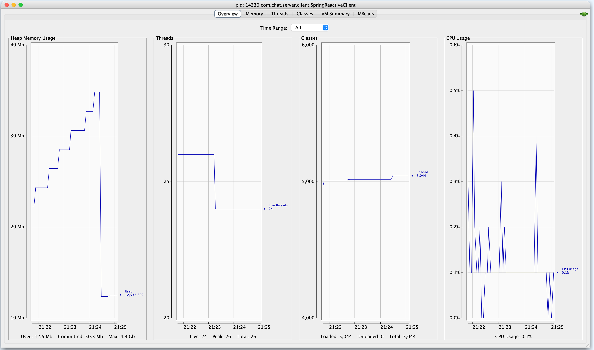

reactive http client
--

```bash
2019-04-07 16:57:12.206  INFO 81681 --- [           main] o.s.s.concurrent.ThreadPoolTaskExecutor  : Initializing ExecutorService 'applicationTaskExecutor'
2019-04-07 16:57:12.439  INFO 81681 --- [           main] o.s.b.w.embedded.tomcat.TomcatWebServer  : Tomcat started on port(s): 9191 (http) with context path ''
2019-04-07 16:57:12.445  INFO 81681 --- [           main] com.chat.server.client.SpringHttpClient  : Started SpringHttpClient in 2.665 seconds (JVM running for 3.111)
stream event: ChatResponse(message=hi how can i help you)
stream event: ChatResponse(message=Please see stuff)
stream event: ChatResponse(message=whatever)
```


Reactive call
------------

```bash
curl localhost:8080/initiate/prayagupa
```

```bash
21:18:50.647 [reactor-http-nio-2] DEBUG reactor.netty.resources.DefaultPooledConnectionProvider - [95e86540-1, L:/127.0.0.1:64765 - R:localhost/127.0.0.1:8080] onStateChange(GET{uri=/listen, connection=PooledConnection{channel=[id: 0x95e86540, L:/127.0.0.1:64765 - R:localhost/127.0.0.1:8080]}}, [request_sent])

21:19:51.825 [reactor-http-nio-2] DEBUG io.netty.handler.codec.compression.Brotli - brotli4j not in the classpath; Brotli support will be unavailable.
21:19:51.827 [reactor-http-nio-2] DEBUG reactor.netty.http.client.HttpClientOperations - [95e86540-1, L:/127.0.0.1:64765 - R:localhost/127.0.0.1:8080] Received response (auto-read:false) : RESPONSE(decodeResult: success, version: HTTP/1.1)
HTTP/1.1 200 
Content-Type: <filtered>
Transfer-Encoding: <filtered>
Date: <filtered>
21:19:51.828 [reactor-http-nio-2] DEBUG reactor.netty.resources.DefaultPooledConnectionProvider - [95e86540-1, L:/127.0.0.1:64765 - R:localhost/127.0.0.1:8080] onStateChange(GET{uri=/listen, connection=PooledConnection{channel=[id: 0x95e86540, L:/127.0.0.1:64765 - R:localhost/127.0.0.1:8080]}}, [response_received])
21:19:51.830 [reactor-http-nio-2] DEBUG org.springframework.web.reactive.function.client.ExchangeFunctions - [1c852c0f] [95e86540-1, L:/127.0.0.1:64765 - R:localhost/127.0.0.1:8080] Response 200 OK
21:19:51.840 [reactor-http-nio-2] DEBUG reactor.netty.channel.FluxReceive - [95e86540-1, L:/127.0.0.1:64765 - R:localhost/127.0.0.1:8080] [terminated=false, cancelled=false, pending=0, error=null]: subscribing inbound receiver
21:19:51.843 [reactor-http-nio-2] DEBUG org.springframework.core.codec.StringDecoder - [1c852c0f] [95e86540-1, L:/127.0.0.1:64765 - R:localhost/127.0.0.1:8080] Decoded "data:prayagupa connected."
21:19:51.843 [reactor-http-nio-2] DEBUG org.springframework.core.codec.StringDecoder - [1c852c0f] [95e86540-1, L:/127.0.0.1:64765 - R:localhost/127.0.0.1:8080] Decoded ""
Received: prayagupa connected.
```


